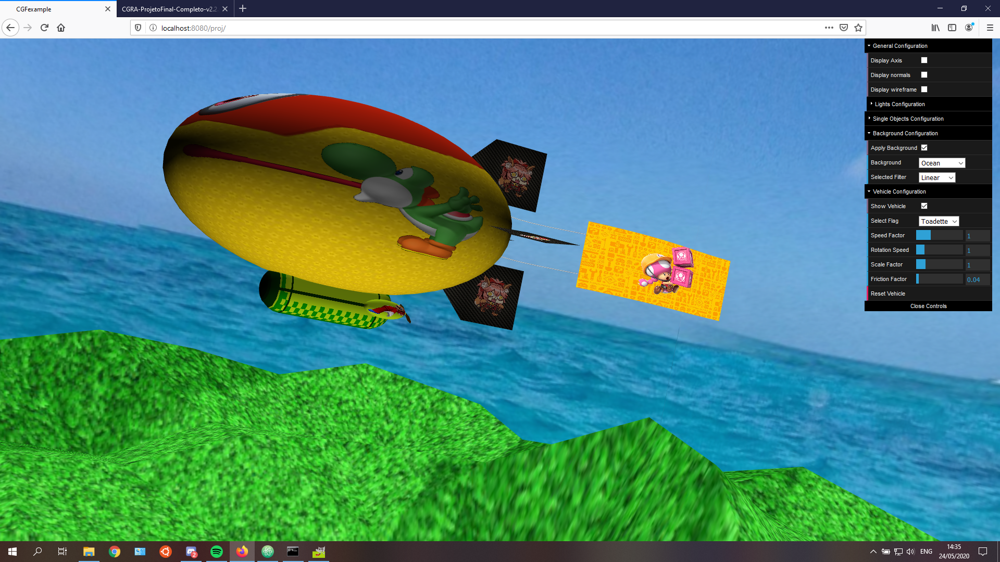

# Computer Graphics Project


- **Short Description**:
- **Environment**: Any
- **Tools Used**: JavaScript, WebGL, CGF
- **Institution**: [FEUP](https://sigarra.up.pt/feup/en/web_page.Inicial)
- **Course**: [MIEIC](https://sigarra.up.pt/feup/en/cur_geral.cur_view?pv_curso_id=742&pv_ano_lectivo=2019)
- **Curricular Unit**: [CGRA](https://sigarra.up.pt/feup/pt/ucurr_geral.ficha_uc_view?pv_ocorrencia_id=436438) (Computer Graphics)

## Github Page


## Group Members
- Telmo Baptista (up201806554@fe.up.pt)

## Program usage
To host the project, it will be needed to setup a server.  
This can be done in multiple ways, and it's up to you to decide which one you use.  
As an example you can use Python to host the server by doing in the project directory:
```shell
python -m http.server 8080
```
For this you must have Python installed on your computer, and a browser compatible with WebGL, such as Google Chrome, Mozilla Firefox, etc.

## Description
The aim of the project was to develop a basic scene of a zeppelin overflying a terrain, the zeppelin has basic movement (acceleration and rotation) and can release supplies.

## Controls
Apart from the GUI controls, there's some keyboard and mouse input controls to control the scene:
- **Mouse movement** - Move the user's POV
- **CTRL + Mouse Movement** - Zoom in/out
- **W** - accelerate
- **S** - brake
- **A** - turn left
- **D** - turn right
- **R** - reset vehicle to center and supplies
- **L** - drop supply

## Screenshots
### Vehicle Model


### Vehicle Supplies


### Flag Motion


## Extras
- The flag has an wire connecting to the zeppelin, the wire is also animated accordingly
- Similar to the rudders, the flag also is pushed on the opposite direction the vehicle is turning
- Each cube map has its own sea level, so the height of the ceiling also varies, this is to provide a better aspect of the scene at ground level
- There's a simple concept of friction applied on to the vehicle that will make the vehicle slowly stop accelerating and rotate if there's no user inputs to do so
